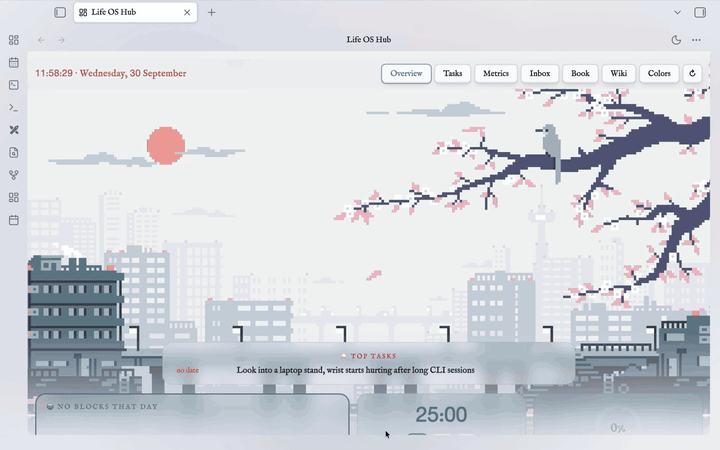

# obsidian-life-os

[](docs/demo.mp4)

*50-second demo on the sample person's data (click for the MP4): today's Hub, scheduling tasks by drag and drop, weekly metrics, the book reader, searching the Library wiki, the colour editor, and starting the agent in a terminal inside Obsidian. The agent commands (`/morning`, `/evening`, `/weekly`, `/library`) themselves aren't shown.*

**One place to run your whole life — plans, tasks, journal, everything you learn — in one Obsidian vault, where an AI agent does the running so you don't have to maintain a system.**

## The idea

Most productivity setups make *you* the maintainer: you build databases and templates in Notion or a dozen apps, keep them tidy, and decide every day what to do next. The system becomes one more project, and it gets dropped like the others.

Here it's the opposite: one place, and an agent that does the running. You're interviewed once about who you are and where you're heading; from then on the agent plans from what it knows, triages, keeps the record and compiles what you learn. You show up, report honestly, and choose between the options it offers.

One folder of plain markdown, four things in it: **what you're doing** (calendar, tasks), **where you're heading** (avatar, roadmap), **how it's going** (journal, patterns), **what you know** (a wiki). It doesn't replace specialised tools like your bank or medical records.

## How it works

The vault has two parts, each with its own job:

**Life** is the day-to-day. `/morning` shows today's calendar blocks, each with a concrete minimum. `/evening` (about 10 minutes) gives an honest verdict on whether that minimum was met, plans tomorrow, and adds one factual entry to a log. `/weekly` reviews the week, asks what changed, and only then blocks time. Something counts as a pattern only after it repeats three times, so one good or bad day never redefines you. Your journal and notes stay yours.

**Library** is what you know. You drop things in — a web clip, `/note`, `/source` — and forget them. When you have 20–40 minutes, `/library ingest` turns one source at a time into linked wiki pages that cite it; later you ask a question and get an answer with citations. Nothing compiles by itself.

The two are joined in one direction: Life may drop a file into the Library's queue, and the Library never writes into Life.

## Is it for you?

**Yes, if** you lose projects to bookkeeping rather than lack of interest, will spend about 10 minutes each evening, and are fine with an agent reading and writing your notes. It isn't only for programmers.

**No, if** you want a pretty notebook or enjoy designing your own system, don't want to run an agent (Claude Code or Codex, with their own cost), or need something proven — this is one person's system, early, and not yet validated on other people (see *Status*).

You can look before you commit: a fresh clone holds a made-up person's data, and one command removes it.

> **Already set up?** [`START-HERE.html`](START-HERE.html) is the short intro, [`HANDBOOK.html`](HANDBOOK.html) the day-to-day reference. Open them in a browser or Obsidian's HTML Reader — in Obsidian the links don't click, and `Cmd/Ctrl+Shift+B` opens the active `.html` file in your browser (details in the Handbook).

## What's inside

- `Life/` — calendar, journal, inbox, patterns, and the roadmap (avatar, roadmap brief, backlog). Changes every day, on purpose.
- `Library/` — a wiki compiled from sources you actually read. Grows as you read.
- `System/` — templates, checkpoints, scripts, the sample data. Support files, not a zone.

**Who writes where**


`/morning`, `/evening` and `/weekly` may drop a file into `Library/sources/inbox/` and nothing else in Library. The Library reads `avatar.md` and `roadmap-brief.md` for context and never writes into `Life/`. Two sessions never compile the wiki at once.

## From zero to a plan

**`/avatar`** asks only what would change a priority or a week's plan; relationships, family, health and exact money stay out unless you bring them up, and any question can be skipped. It writes `Life/roadmap/avatar.md`; run it again to update.

**`/roadmap`** reads the avatar, offers 2–3 roadmaps with a recommendation, and writes `Life/roadmap/roadmap-brief.md` section by section, showing each change first: phases (about three months) with a checkable definition of done and a date, a strict priority order with protected time outside it, closed decisions, and a *Now* section (current step, weekly targets) that `/weekly` may propose to update. Run it again when a phase ends: it checks the definition of done against the facts you give, goes through the backlog, and opens the next phase. It refuses to write while John's sample data (below) is still in the vault.

## The daily loop


Every block on the calendar carries a concrete **minimum** — not "work on the project," but something checkable when the block ends. `/evening` also decides, in one honest sentence, whether the day's minimum actually got done. A pattern only gets to matter once it has shown up three separate times in the raw log, not the first time it looks like one.

## The Library pipeline


A page only gets written when a source contains an actual mechanism — something with a "why," not just a fact. Every page keeps a visible link back to the file it came from. Every folder has one entry-point page (its MOC) written in the order you'd actually learn the material, and a page that isn't reachable from its folder's MOC is treated as invisible.

## Good to know

**The sample person (John).** A fresh clone contains a made-up person's data so Life OS Hub has something to show. `/avatar` clears it after asking (files go to the system trash, only unchanged ones); `python3 System/demo/demo.py clear` / `restore` do it by hand, and both are dry runs until you add `--apply`.

**Facts by code.** `System/scripts/vault-status.py` computes what a model would eyeball — avatar age, days since `/weekly`, queue sizes, phase deadlines. `/weekly` runs it; the Hub's **Status** tab shows it and, on the desktop app, re-runs it.

**Privacy.** `avatar.md`, the roadmap brief and backlog, `INBOX.md`, `Journal/`, `Notes/`, the two `Patterns/` files and everything in `System/Attachments/` (pasted photos, banner pictures) are in `.gitignore` on purpose, so a public push doesn't publish them (`git add -f` puts one in a private repo; git then backs it up, otherwise it doesn't).

Full detail for all three: the Handbook, *Vault-wide*.

## Repository layout

```
obsidian-life-os/
├── README.md                     — this file
├── START-HERE.html               — short intro: what this is, why it exists, hands off to HANDBOOK.html
├── HANDBOOK.html                 — the day-to-day reference: the loop, commands, formats, glossary, why it works this way — Life and Library, side by side
├── COLLABORATION.md              — how the agent should work with you; read every session
├── CLAUDE.md / AGENTS.md         — thin router: names the zones, points to their own CLAUDE.md
├── Life/                         — changes daily
│   ├── Calendar/                 — one note per block, drawn by Full Calendar
│   ├── Journal/                  — daily notes: your journaling + the agent's plan sections
│   ├── INBOX.md                  — brain-dump of tasks, triaged by /evening
│   ├── Patterns/                 — raw observation log → patterns confirmed on the 3rd repeat
│   ├── roadmap/                  — avatar.md (from `/avatar`), roadmap-brief.md (from `/roadmap`) + its .previous backup, backlog
│   ├── Notes/                    — your own notes; the agent doesn't touch them
│   └── Resources/                — tools and recommendations
├── Library/                      — what you learn; grows as you read
│   ├── sources/
│   │   ├── inbox/                — capture queue; the only place Life may write into
│   │   ├── articles/             — archive of ingested sources, never edited
│   │   └── own-notes/            — same archive, for your own notes
│   ├── wiki/                     — compiled pages, one MOC per topic folder
│   │   ├── hot.md                — start here
│   │   └── _catalog.md           — one-line pointers that didn't earn a page
│   ├── CAPTURE.md                — four ways into the queue, for you
│   ├── SCHEMA.md                 — how the Library operates: layers, frontmatter, rules — for the agent
│   ├── INDEX.md                  — catalog of every wiki page — mostly for the agent
│   ├── log.md                    — append-only chronicle of compiles
│   ├── lint.py                   — mechanical health check, zero LLM
│   ├── books/                    — your reading conclusions, one file per session
│   ├── explanations/             — long-form answers to "explain X"
│   └── workshops/                — materials from hands-on learning sessions
├── System/                       — extras: templates, checkpoints, attachments
│   ├── Templates/                — daily note template
│   ├── Checkpoints/              — session handoffs for a fresh chat
│   ├── Attachments/              — images and files
│   ├── demo/                     — John's sample data and its tooling (`.demo-active` marks that he is still here)
│   │   ├── shift-demo-week.py    — moves the demo week to the current week (optional)
│   │   ├── demo.py               — `clear` moves John's data to the system trash (run by `/avatar`), `restore` writes back only what is missing; dry run by default
│   │   └── john/, stubs/         — frozen copy of John's files, and the empty versions `clear` leaves behind
│   ├── status.json, runs.json        — generated by vault-status.py (git-ignored)
│   ├── scripts/vault-status.py       — facts by code: avatar age, days since /weekly, daily-loop gaps, queues, phase dates; feeds /weekly and the Hub's Status tab
│   ├── scripts/quickadd-open-in-browser.js — the Cmd/Ctrl+Shift+B macro that opens an .html file in your browser
│   ├── scripts/setup-symlinks.py     — fixes broken symlinks after a plain `git clone` (Windows)
│   ├── scripts/install-plugins.py    — downloads the community plugins and the Border theme from GitHub
│   └── scripts/sync-agent-mirrors.sh — regenerates .agents/ and .codex/ after a skill or command changes
├── .claude/
│   ├── commands/                 — /morning, /evening, /weekly, /library, /source
│   ├── skills/                   — avatar, roadmap, note, explain, research, link-notes, checkpoint
│   ├── hooks/library.py          — blocks writes to sources/, checks fresh wiki pages
│   └── settings.json             — wires the hooks
├── .agents/                      — the same skills and commands, for Cursor
├── .codex/skills/                — the same skills for Codex, plus a `cmd-*` shim per command (Codex can't read `.claude/commands/` or `.agents/` at all)
├── .obsidian/                    — vault config, the bundled Life OS Hub plugin, the look (snippets + Style Settings)
└── .github/diagrams/             — README diagrams: generators, HTML sources, PNGs
```

## Setup

**You need:** [Obsidian](https://obsidian.md), Python 3, git, and an agent: [Claude Code](https://claude.com/claude-code) or Codex.

### macOS

```bash
git clone https://github.com/<you>/obsidian-life-os.git
cd obsidian-life-os
python3 System/demo/shift-demo-week.py   # optional: moves John's demo week to today
python3 System/scripts/install-plugins.py
```

### Windows

Install [Git for Windows](https://git-scm.com/download/win) (Claude Code needs its Git Bash for the hooks) and Python from [python.org](https://www.python.org/downloads/) with the `py` launcher — the Microsoft Store `python3` is only a stub, so use `py`.

```powershell
git clone https://github.com/<you>/obsidian-life-os.git
cd obsidian-life-os
py System\demo\shift-demo-week.py   # optional: moves John's demo week to today
py System\scripts\setup-symlinks.py
py System\scripts\install-plugins.py
```

`setup-symlinks.py` puts **copies** where the repo has symlinks (Windows can't create them without Developer Mode) — run it again after you edit a `CLAUDE.md`, a skill or a command. The Terminal plugin also needs `py -m pip install psutil pywinpty`.

`shift-demo-week.py` is optional (`/avatar` clears John either way). `install-plugins.py` downloads the community plugins (Full Calendar, QuickAdd, Homepage, Style Settings, Excalidraw, HTML Reader, Terminal) and the Border theme into `.obsidian/`; run it again to update. It never touches the bundled Life OS Hub.

### Then, either OS

1. **Open it in Obsidian.** Open folder as vault → pick the cloned folder, then turn off Restricted mode (Settings → Community plugins) — the one step no script can do, Obsidian keeps it as app state on purpose. The plugins were downloaded by `install-plugins.py` in the step above (run it first if you haven't) and their settings ship in `.obsidian/plugins/`, so all that's left is to enable them in the same screen — including the bundled **Life OS Hub** and **HTML Reader** (needed to open `START-HERE.html` or `HANDBOOK.html` from inside Obsidian — without it, Obsidian doesn't know what to do with an `.html` file; open them in a regular browser instead if you'd rather skip enabling that one). Homepage opens Life OS Hub on every start.
2. **The look.** The Border theme is already selected; check Settings → Appearance → CSS snippets that `border-fonts` and `life-os-look` are on (press reload if the list looks empty). Colours live in Style Settings → Border.
3. **Life OS Hub's banner (optional).** Drag a picture onto the empty banner in the Overview tab. Details, and the Colors tab: the Handbook, *Vault-wide*.
4. **Browser capture (Web Clipper).** Install the official Obsidian Web Clipper extension and set its **note location** to `Library/sources/inbox` — the one step that matters. Setup and fallbacks: `Library/CAPTURE.md`.
5. **Start the agent.** Open Claude Code (or Codex) in the repo root for a full-vault session, or `cd Life` / `cd Library` first if you only need one zone — see below. Then run **`/avatar`** (it offers to clear John first, separately for `Life/` and `Library/`), then **`/roadmap`** — both are described in *From zero to a plan* above. After that, `/morning`, and open the Life OS Hub **Status** tab to see where the system stands.


## Working with an agent: zones and `cd`

The root `CLAUDE.md` is a thin router: it names the zones and points to each zone's own `CLAUDE.md`, which loads the first time the agent reads a file there.

- **One zone →** `cd` into it first, then start the agent: cheaper, and it can't write somewhere it shouldn't.
- **Two zones →** start from the repo root. A zone is not a wall — the write rules enforce the boundary.

Slash commands (`/morning`, `/evening`, `/weekly`, `/library`, `/source`) and the skills `/avatar` and `/roadmap` work from any starting point in Claude Code and Cursor. Codex has no slash syntax: the commands exist there as `cmd-morning` etc., the skills under their own names — ask by name, or describe what you want.

## Status

Early. The daily loop and the Library pipeline work end to end; the wiki here is intentionally small. `/avatar`, `/roadmap`, `demo.py` and the Status tab are new: checked with scripts and simulated interviews (different fields, a vague and oversharing interviewee, refusal while John is present, both review paths), not yet over weeks of real use. The Status tab was tested against a stub of Obsidian's API, not a live Obsidian, and clearing John through the Windows Recycle Bin is untested. Open items: an undo story for a botched wiki compile, and watching what a real avatar and roadmap do to a real week before adding more.

## License

MIT — see [LICENSE](LICENSE).
